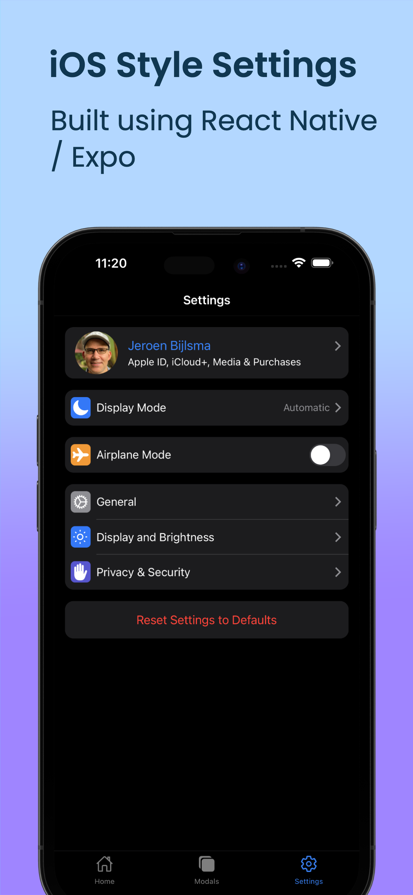
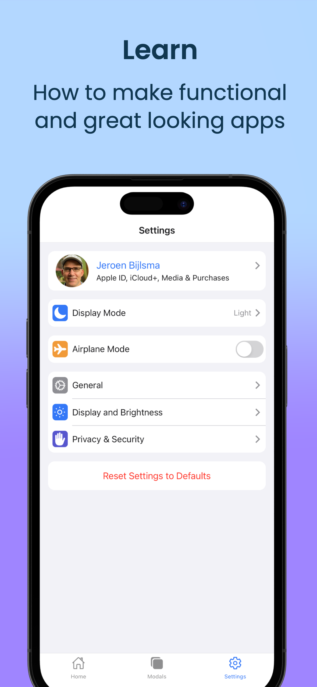
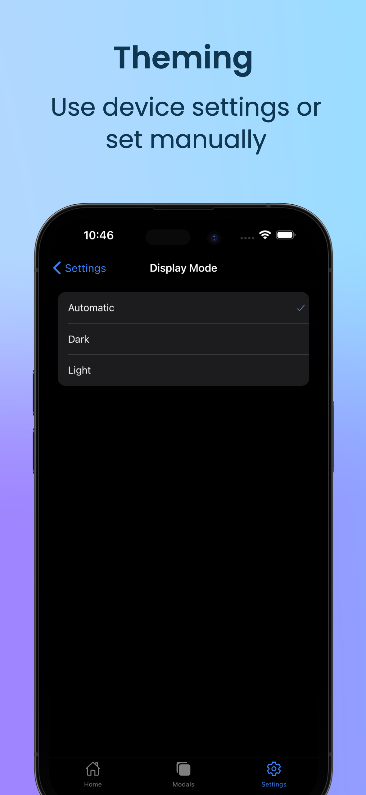
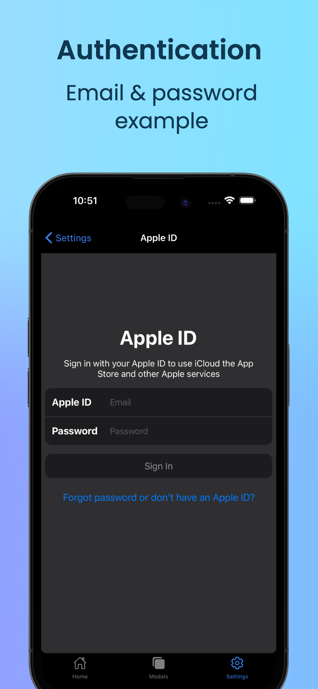
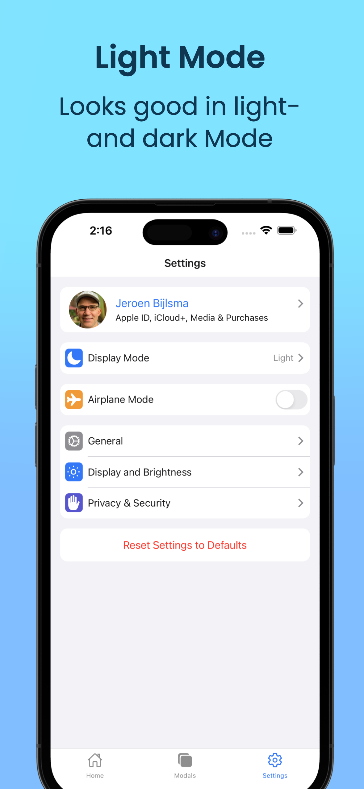
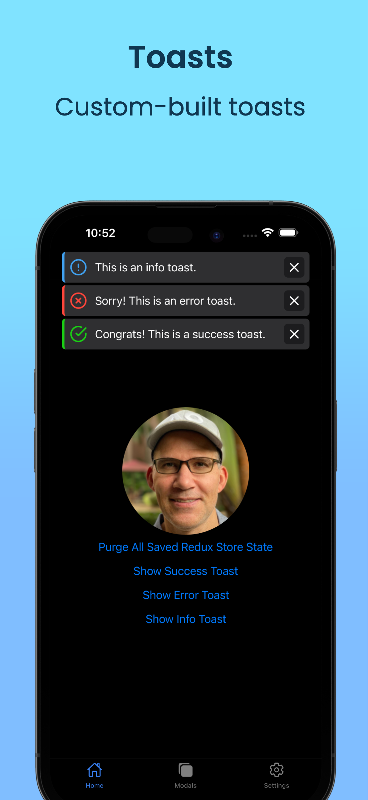

# SETTINGS

Example of iOS style setting management using React Native and Expo. Settings are managed using Redux-Toolkit and stored using Redux-Persist. The App also supports Dark Mode.

Screenshots were made using Screenshots Pro (https://screenshots.pro/).
