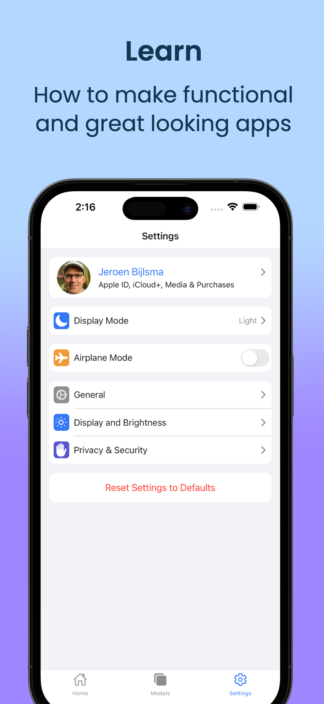

# Settings

Example of iOS style setting management using React Native and Expo. Settings are managed using Redux-Toolkit and stored using Redux-Persist. The App also supports Dark Mode.

  
  
  

  
  
  

Screenshots were made using Screenshots Pro (https://screenshots.pro/).

Alternatives to create mockups / app store screenshots and videos:

- Rotato (https://rotato.app): create 3d mockups (also has a Figma flugin). Free version has watermark.
- Figma: nice tool with loads of plugins for creating mockups. Free version is very limited though: no video support and not possible to export elements to library.
- Angle plugin for Figma (https://www.figma.com/community/plugin/778645840235495725/Angle-Mockups): free library of mockups / shapes, but customizing them works best with the paid version of Figma (Professional).
- Vectary 3D Elements plugin for Figma (https://www.figma.com/community/plugin/769588393361258724/Vectary-3D-Elements): loads of interesting 3D shapes
